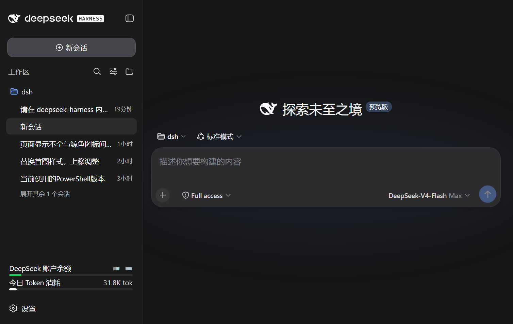
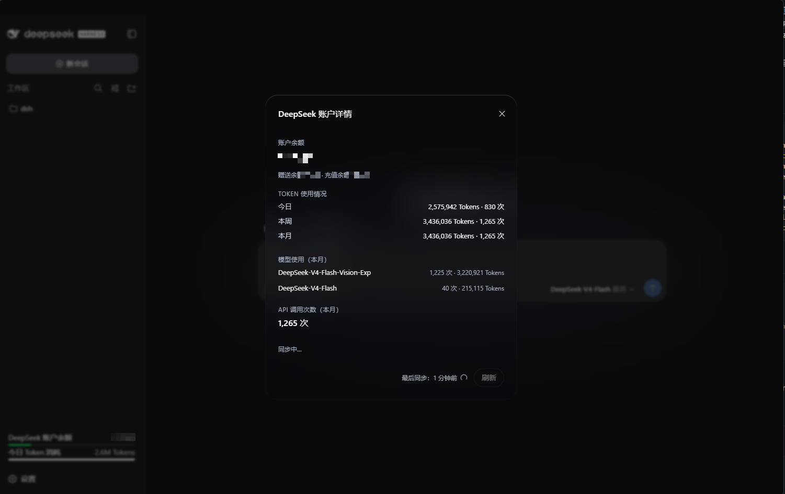
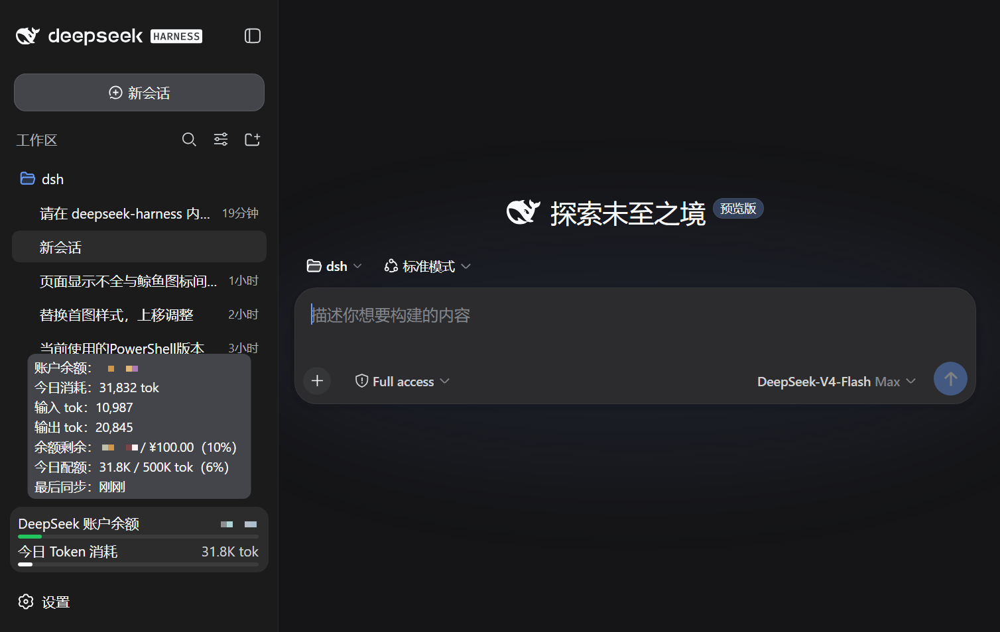

# dsh-balance-status

**极简型插件（Minimal Plugin）**：DeepSeek 账户余额状态组件——一个 slot 入口、
一个只读接口、零配置，嵌在 Harness Web 侧边栏底部。

```
DeepSeek 账户余额    ¥17.83      ████████░░  余额剩余
今日 Token 消耗      2.6M tok     ██████████  今日已用
```

> 与重量级插件（改布局、建面板、开配置页）相反：本次只占两行字 + 两条能量条，
> 装上即用，卸下即净。

## 界面预览

| 侧边栏组件 | 详情弹窗（深色玻璃） | 悬停提示 |
| --- | --- | --- |
|  |  |  |

## 特性

- **两行状态 + 能量条**：余额剩余量（绿）/ 今日消耗量（品牌色），收起侧边栏时
  为两条迷你条；
- **悬停提示**：余额、今日/输入/输出 tok、配额百分比、最后同步；
- **玻璃详情窗**：余额（总额/赠送/充值）、今日/本周/本月、模型使用、
  API 调用次数、手动刷新；深/浅主题成对适配；
- **数据**：余额走 DeepSeek 官方 API（复用 Models 页凭证）；消耗量聚合本地
  会话日志（zstd JSONL，按天分桶增量重读）；60s 自动刷新，支持 `?force=1`。

## 安装与验证

```powershell
dsh plugin --profile web add github:ZXCWT666/dsh-balance-status     # 重启 Harness 应用后生效

(Invoke-WebRequest "http://127.0.0.1:3080/balance-status/status?force=1").Content   # 手动刷新一次
```

> GitHub 源安装（公开仓库，免凭证）。也可以把仓库克隆到本地后
> `add <本地克隆路径>`。

> 上面这条是命令行版的「刷新」（`?force=1` 绕过 60s 缓存），Windows PowerShell 下用
> `Invoke-WebRequest` 写法（或直接用 Win10+ 自带的 `curl.exe`）。

开发：`pnpm install` → `pnpm check`（构建 + 冒烟）；修改 profile 需重启，
仅改 `src/*` 后重建 bundle 刷新页面即可。

## 文档

- [`docs/architecture.md`](docs/architecture.md) — 架构与设计取舍
- [`docs/ci.md`](docs/ci.md) — CI 状态与本地验证
- [`CONTRIBUTING.md`](CONTRIBUTING.md) — 贡献指南
- [`CHANGELOG.md`](CHANGELOG.md) — 版本记录
- [`examples/`](examples/) — 组合补丁与接口响应示例

## 目录

```
package.json / cordis.patch.yml     bundle + dsh.client 声明
lib/                                宿主半、浏览器 bundle、共享类型
src/                                组件与样式源码
scripts/                            构建 / 冒烟 / 校验脚本
docs/  examples/  .github/          文档、示例、CI
```

接口：`GET /balance-status/status` → `{ ok, syncedAt, balance, balanceError,
targets, usage, errors }`（字段说明见 `lib/types.d.ts` 与架构文档）。

## 常见问题

**显示「未配置密钥」？**
在 设置 → Models 填入 DeepSeek API Key（或导出 `DEEPSEEK_API_KEY`）。

**能量条比例怎么改？**
按序生效（环境变量优先）：① 宿主设置段 `settings.yaml` 的
`balance-status:`（`balance` / `dailyTokens`，改动即热生效、无需重启）；
② 环境变量 `BALANCE_STATUS_BALANCE_TARGET` / `BALANCE_STATUS_DAILY_TOKENS`；
③ `lib/index.js` 编译默认值（¥100 / 500K）。

**卸载干净吗？**
`dsh plugin --profile web remove dsh-balance-status` + 重启即可，无数据残留。

## License

[MIT](LICENSE)
